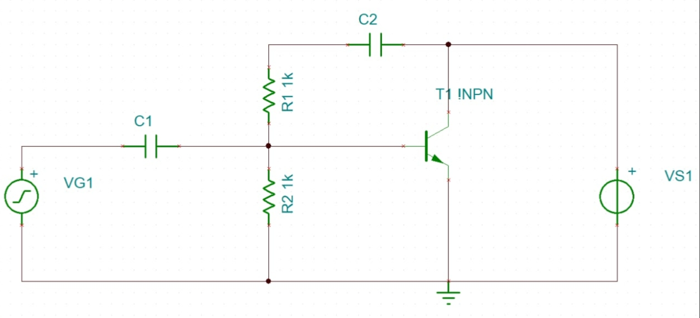
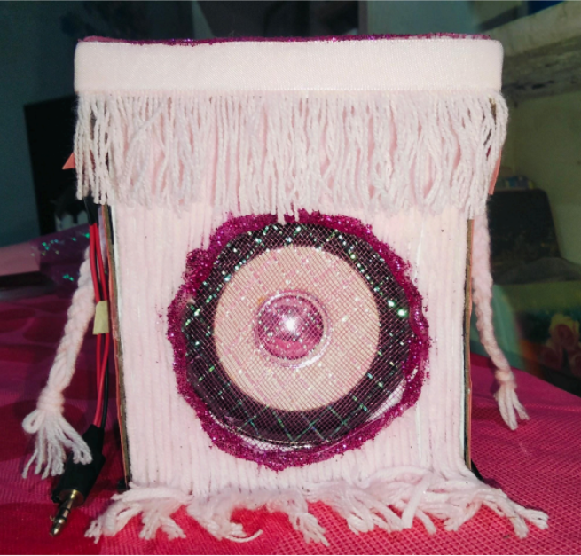

# Kraeza Mae Tabinga Portfolio


Portfolio Repository for Projects, Activities, Documentation, and Creative Work

---

# 👤 Personal Information

### Full Name
```text
Kraeza Mae S. Tabinga
```

### Course & Section
```text
Bachelor of Science in Computer Engineering - CE3A
```

### About Me
Hello! I am Kraeza Mae Tabinga, a Computer Engineering student interested in building interactive and creative systems focused on UI/UX, web development, and immersive digital experiences.

Most of my projects revolve around school projects, fantasy-inspired interfaces, student-centered systems, and experimenting with ideas that combine creativity and technology.

---

# 🛠️ Skills & Technologies

### Programming & Development
```text
- HTML
- CSS
- JavaScript
- React / Next.js
- Firebase
- GitHub
- Proteus
```

### Design & Creative Tools
```text
- UI/UX Design
- Onshape
- Figma
```

### Other Interests
```text
- Web Development
- Creative Systems
- Blockchain Basics
- Interactive Design
```

---

# 🌙 Projects

Contains larger and more developed projects that showcase my technical and creative skills.

---

## ✨ Fantasy LMS Website

### Description
A fantasy-themed gamified learning management system designed to make learning feel more immersive, engaging, and rewarding for students.

### Features
```text
- Fantasy-inspired UI
- Student Dashboard
- Gamified Experience
- Responsive Design
- Firebase Integration
```

### Technologies Used
```text
- React / Next.js
- Firebase
- Tailwind CSS
- Vercel
```

### Screenshots
 
 

---

## 🔊 Audio Amplifier Circuit Using BC547

### Description
This project is a simple audio amplifier circuit built using a BC547 transistor. 

### Technologies Used
```text
- Electronic Circuit Design
- Soldering Techniques
- Analog Electronics
- Proteus (Schematic Design and 3D Modeling)
```

### Components Used
```text
- BC547 Transistor
- Capacitor
- Resistor
- Speaker
- PCB Board
- Audio Jack
- Wires
```

### Screenshots
 
 
 
 

---

## 🖨️ 3D Printer

### Description
Involves the ongoing creation of the 1200mm x 1200mm x 600mm 3D printer.

### Pictures
 

---

## 🌐 3D Model Designs

### Description
Contains activities involving 3D modeling.

### Tool Used
```text
- Onshape
```

### Screenshots
Mini DC Motor  |  MCU  |  BLE Module

 

Keyboard Model

 

---

## 🌐 Sui NFT Marketplace

### Description
A small Web3 NFT marketplace project created while exploring blockchain systems and the Sui ecosystem.

---

# 🎯 Goals

- Improve programming and development skills
- Build more creative systems and projects
- Learn more about software and interactive technologies
- Improve GitHub organization and documentation
- Create a professional online portfolio

---

# 🌱 Current Focus

Currently working on a fantasy-themed gamified learning management system designed to create a more immersive and engaging learning experience for students.

---

# 📬 Contact Information

[](https://github.com/BleuMei)
[](https://linkedin.com/in/in/kraeza-mae-tabinga-4baaa9254/)
[](mailto:azearkt66@gmail.com)

### Portfolio Repository
[[Repository Link]](https://github.com/BleuMei/CpE_Portfolio_Tabinga_BSCpE3A)
